# Oteryn Game Authentication Sequence Diagrams

## Status

Architecture-foundation sequences — 2026-07-21

These diagrams describe the target contracts from ADR 0009. They are not claims that the runtime flow is already implemented.

## Actors

```text
User
Browser
OTClient
Oteryn Identity / Authorization Server
Ticket Store
Oteryn Game Gateway
World Registry
Character Read Adapter
Game Session Adapter
Canary
```

## 1. Successful first-party native login

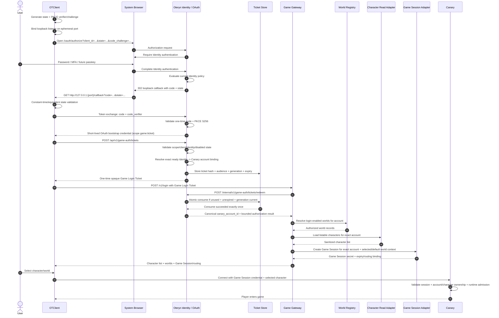
```mermaid
sequenceDiagram
    autonumber
    actor U as User
    participant C as OTClient
    participant B as System Browser
    participant I as Oteryn Identity / OAuth
    participant T as Ticket Store
    participant G as Game Gateway
    participant W as World Registry
    participant R as Character Read Adapter
    participant S as Game Session Adapter
    participant K as Canary

    C->>C: Generate state + PKCE verifier/challenge
    C->>C: Bind loopback listener on ephemeral port
    C->>B: Open /oauth/authorize?client_id=...&state=...&code_challenge=...
    B->>I: Authorization request
    I->>B: Require Identity authentication
    U->>B: Password / MFA / future passkey
    B->>I: Complete Identity authentication
    I->>I: Evaluate current Identity policy
    I-->>B: 302 loopback callback with code + state
    B-->>C: GET http://127.0.0.1:{port}/callback?code=...&state=...
    C->>C: Constant-time/equivalent state validation
    C->>I: Token exchange: code + code_verifier
    I->>I: Validate one-time code + PKCE S256
    I-->>C: Short-lived OAuth bootstrap credential (scope game:ticket)
    C->>I: POST /api/v1/game-auth/tickets
    I->>I: Validate scope/client/Identity/disabled state
    I->>I: Resolve exact ready Identity -> Canary account binding
    I->>T: Store ticket hash + audience + generation + expiry
    I-->>C: One-time opaque Game Login Ticket
    C->>G: POST /v1/login with Game Login Ticket
    G->>I: POST /internal/v1/game-auth/tickets/redeem
    I->>T: Atomic consume if unused + unexpired + generation current
    T-->>I: Consume succeeded exactly once
    I-->>G: Canonical canary_account_id + bounded authorization result
    G->>W: Resolve login-enabled worlds for account
    W-->>G: Authorized world records
    G->>R: Load listable characters for exact account
    R-->>G: Sanitized character list
    G->>S: Create Game Session for exact account + selected/default world context
    S-->>G: Game Session secret + expiry/routing binding
    G-->>C: Character list + worlds + Game Session/routing
    U->>C: Select character/world
    C->>K: Connect with Game Session credential + selected character
    K->>K: Validate session + account/character ownership + runtime admission
    K-->>C: Player enters game
```

### Security notes

- The user password is entered only in the browser-controlled Oteryn Identity surface.
- The OAuth credential terminates at Oteryn Platform ticket issuance.
- Gateway receives only the Game Login Ticket.
- Canary receives only the Game Session credential required by the final compatibility contract.
- Client-supplied account ownership fields are not authoritative.

## 2. User already has an authenticated Oteryn browser session

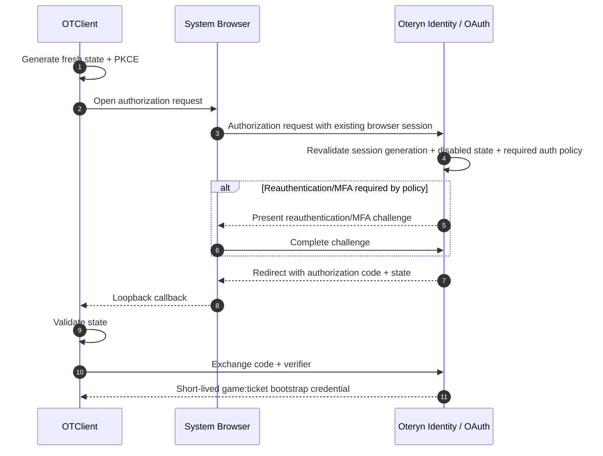
```mermaid
sequenceDiagram
    autonumber
    participant C as OTClient
    participant B as System Browser
    participant I as Oteryn Identity / OAuth

    C->>C: Generate fresh state + PKCE
    C->>B: Open authorization request
    B->>I: Authorization request with existing browser session
    I->>I: Revalidate session generation + disabled state + required auth policy
    alt Reauthentication/MFA required by policy
        I-->>B: Present reauthentication/MFA challenge
        B->>I: Complete challenge
    end
    I-->>B: Redirect with authorization code + state
    B-->>C: Loopback callback
    C->>C: Validate state
    C->>I: Exchange code + verifier
    I-->>C: Short-lived game:ticket bootstrap credential
```

An existing web session may reduce user friction, but a generic web session alone does not authorize the ticket API. The native client must complete the OAuth grant and present a scoped OAuth credential.

## 3. MFA-enabled Identity

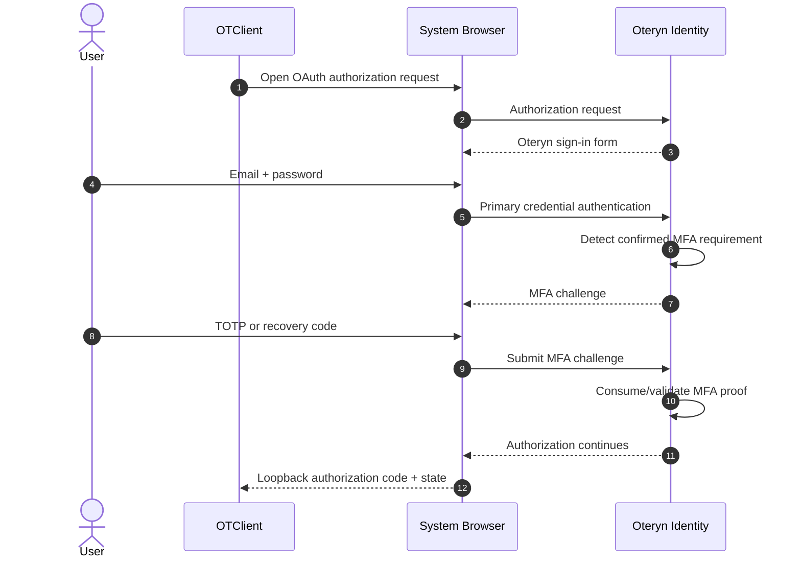
```mermaid
sequenceDiagram
    autonumber
    actor U as User
    participant C as OTClient
    participant B as System Browser
    participant I as Oteryn Identity

    C->>B: Open OAuth authorization request
    B->>I: Authorization request
    I-->>B: Oteryn sign-in form
    U->>B: Email + password
    B->>I: Primary credential authentication
    I->>I: Detect confirmed MFA requirement
    I-->>B: MFA challenge
    U->>B: TOTP or recovery code
    B->>I: Submit MFA challenge
    I->>I: Consume/validate MFA proof
    I-->>B: Authorization continues
    B-->>C: Loopback authorization code + state
```

OTClient does not implement or receive the MFA secret/challenge credential.

## 4. User cancels browser authorization

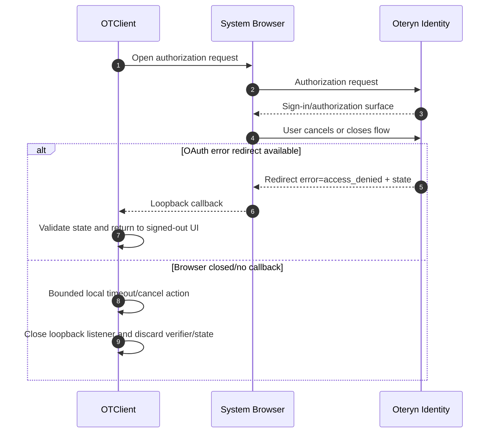
```mermaid
sequenceDiagram
    autonumber
    participant C as OTClient
    participant B as System Browser
    participant I as Oteryn Identity

    C->>B: Open authorization request
    B->>I: Authorization request
    I-->>B: Sign-in/authorization surface
    B->>I: User cancels or closes flow
    alt OAuth error redirect available
        I-->>B: Redirect error=access_denied + state
        B-->>C: Loopback callback
        C->>C: Validate state and return to signed-out UI
    else Browser closed/no callback
        C->>C: Bounded local timeout/cancel action
        C->>C: Close loopback listener and discard verifier/state
    end
```

No ticket or Game Session is created.

## 5. `state` mismatch

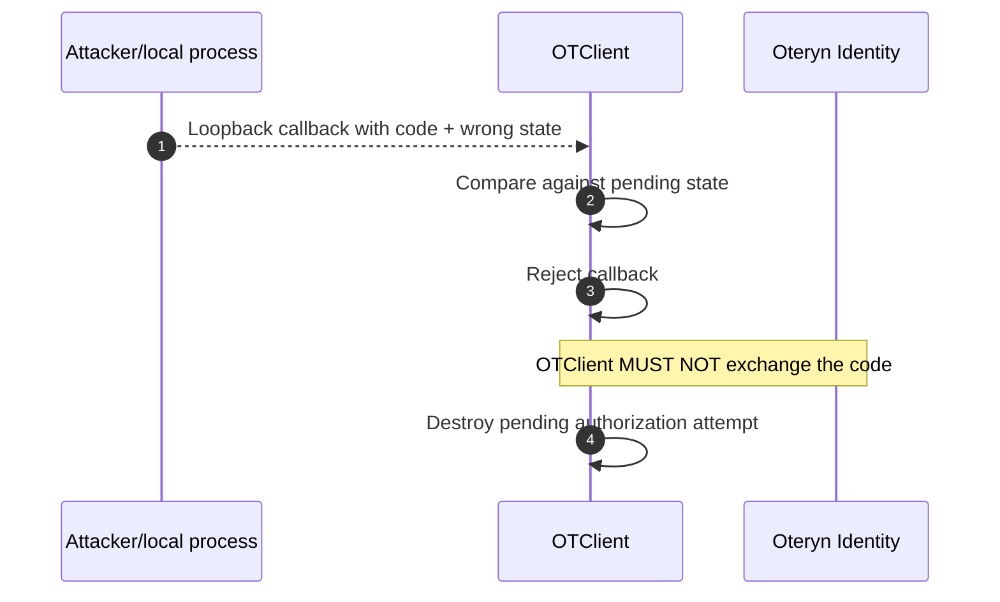
```mermaid
sequenceDiagram
    autonumber
    participant X as Attacker/local process
    participant C as OTClient
    participant I as Oteryn Identity

    X-->>C: Loopback callback with code + wrong state
    C->>C: Compare against pending state
    C->>C: Reject callback
    Note over C,I: OTClient MUST NOT exchange the code
    C->>C: Destroy pending authorization attempt
```

## 6. Invalid PKCE verifier

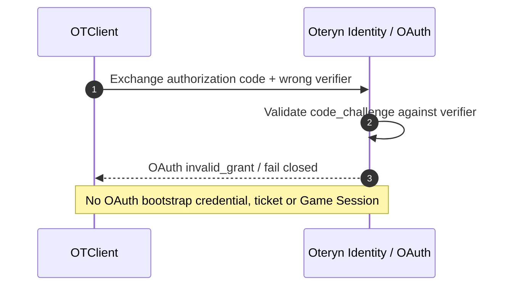
```mermaid
sequenceDiagram
    autonumber
    participant C as OTClient
    participant I as Oteryn Identity / OAuth

    C->>I: Exchange authorization code + wrong verifier
    I->>I: Validate code_challenge against verifier
    I-->>C: OAuth invalid_grant / fail closed
    Note over C,I: No OAuth bootstrap credential, ticket or Game Session
```

## 7. Expired authorization code

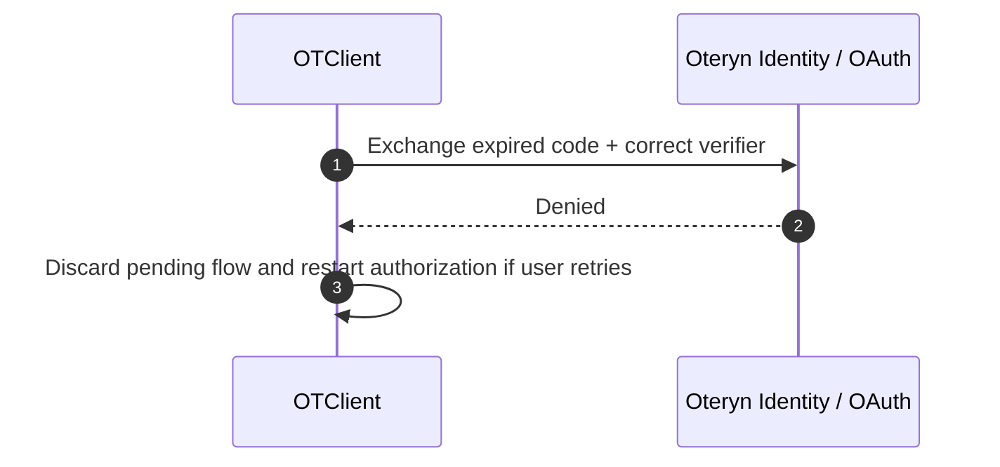
```mermaid
sequenceDiagram
    autonumber
    participant C as OTClient
    participant I as Oteryn Identity / OAuth

    C->>I: Exchange expired code + correct verifier
    I-->>C: Denied
    C->>C: Discard pending flow and restart authorization if user retries
```

## 8. Successful Game Login Ticket issuance

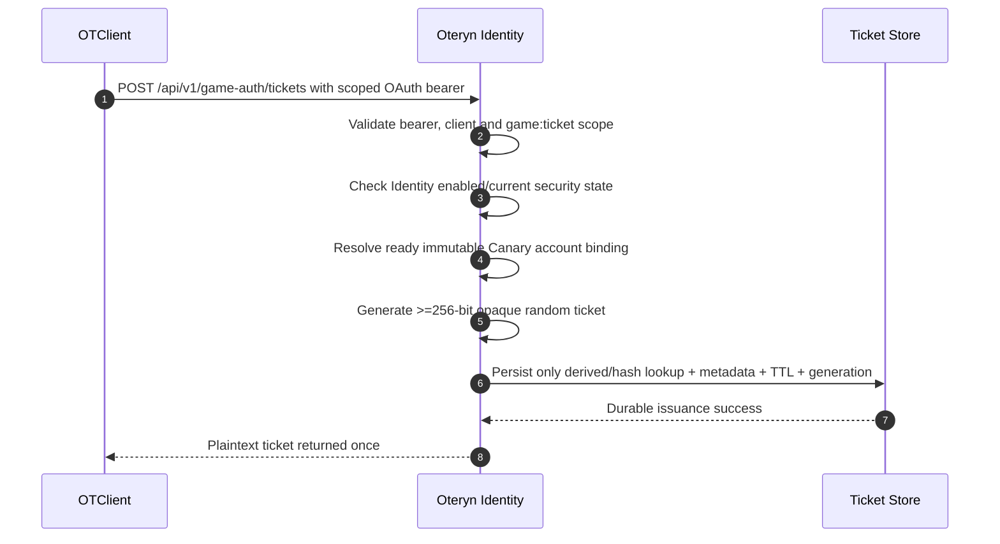
```mermaid
sequenceDiagram
    autonumber
    participant C as OTClient
    participant I as Oteryn Identity
    participant T as Ticket Store

    C->>I: POST /api/v1/game-auth/tickets with scoped OAuth bearer
    I->>I: Validate bearer, client and game:ticket scope
    I->>I: Check Identity enabled/current security state
    I->>I: Resolve ready immutable Canary account binding
    I->>I: Generate >=256-bit opaque random ticket
    I->>T: Persist only derived/hash lookup + metadata + TTL + generation
    T-->>I: Durable issuance success
    I-->>C: Plaintext ticket returned once
```

If persistence fails, no usable ticket is returned.

## 9. Missing/pending/conflict Canary binding

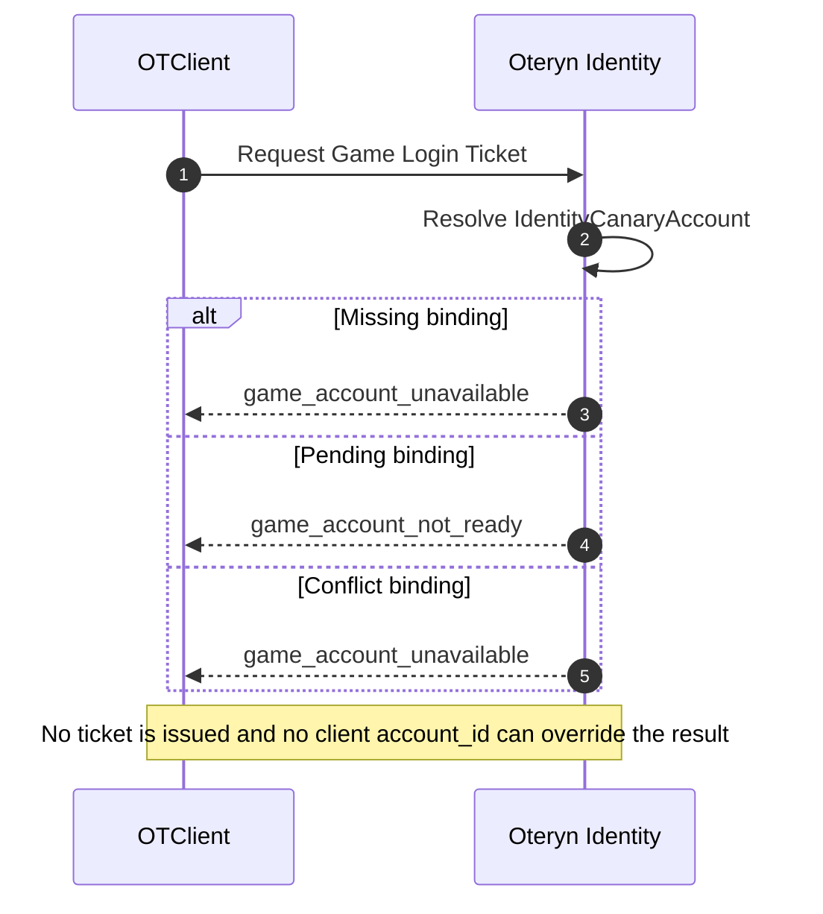
```mermaid
sequenceDiagram
    autonumber
    participant C as OTClient
    participant I as Oteryn Identity

    C->>I: Request Game Login Ticket
    I->>I: Resolve IdentityCanaryAccount
    alt Missing binding
        I-->>C: game_account_unavailable
    else Pending binding
        I-->>C: game_account_not_ready
    else Conflict binding
        I-->>C: game_account_unavailable
    end
    Note over C,I: No ticket is issued and no client account_id can override the result
```

Public errors may be coarser than internal classifications to avoid information leakage.

## 10. Atomic ticket redeem success

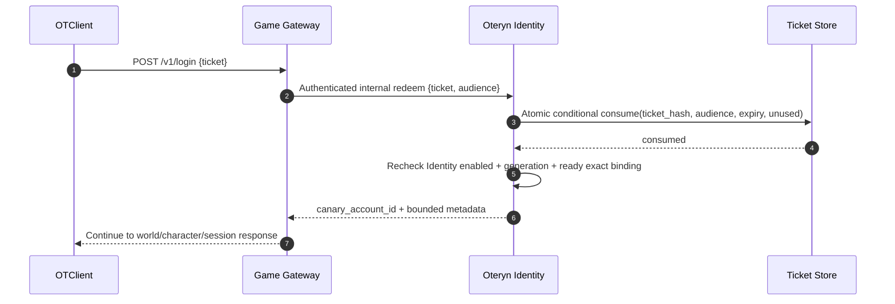
```mermaid
sequenceDiagram
    autonumber
    participant C as OTClient
    participant G as Game Gateway
    participant I as Oteryn Identity
    participant T as Ticket Store

    C->>G: POST /v1/login {ticket}
    G->>I: Authenticated internal redeem {ticket, audience}
    I->>T: Atomic conditional consume(ticket_hash, audience, expiry, unused)
    T-->>I: consumed
    I->>I: Recheck Identity enabled + generation + ready exact binding
    I-->>G: canary_account_id + bounded metadata
    G-->>C: Continue to world/character/session response
```

## 11. Concurrent ticket replay

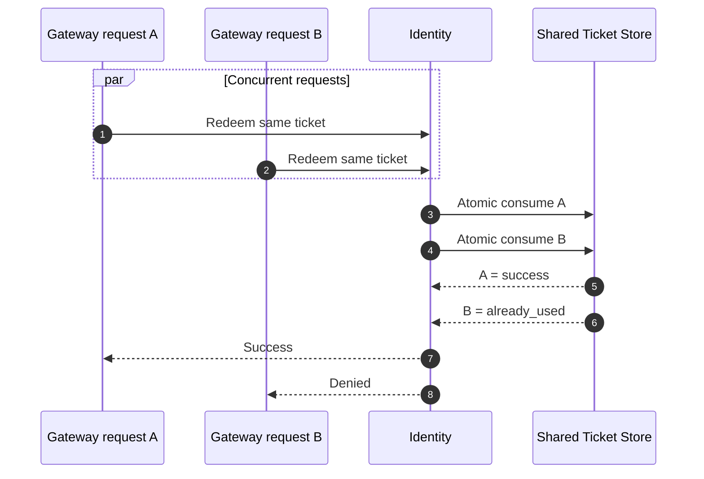
```mermaid
sequenceDiagram
    autonumber
    participant A as Gateway request A
    participant B as Gateway request B
    participant I as Identity
    participant T as Shared Ticket Store

    par Concurrent requests
        A->>I: Redeem same ticket
        B->>I: Redeem same ticket
    end
    I->>T: Atomic consume A
    I->>T: Atomic consume B
    T-->>I: A = success
    T-->>I: B = already_used
    I-->>A: Success
    I-->>B: Denied
```

The ordering of A/B is nondeterministic; the invariant is exactly one success.

## 12. Expired or already-used ticket

```mermaid
sequenceDiagram
    autonumber
    participant C as OTClient
    participant G as Game Gateway
    participant I as Oteryn Identity
    participant T as Ticket Store

    C->>G: Login with ticket
    G->>I: Redeem
    I->>T: Atomic conditional consume
    T-->>I: expired OR already_used OR not_found
    I-->>G: Generic redeem denied
    G-->>C: Login credential expired/invalid; restart sign-in
```

Gateway receives no alternate password/DB-session fallback.

## 13. Security generation changes between issue and redeem

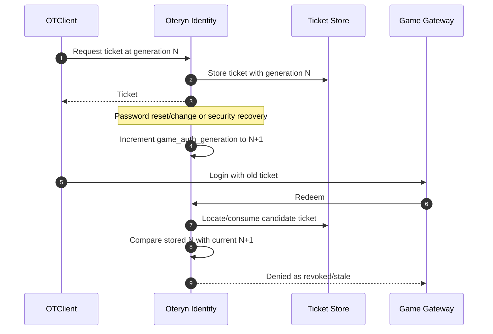
```mermaid
sequenceDiagram
    autonumber
    participant C as OTClient
    participant I as Oteryn Identity
    participant T as Ticket Store
    participant G as Game Gateway

    C->>I: Request ticket at generation N
    I->>T: Store ticket with generation N
    I-->>C: Ticket
    Note over I: Password reset/change or security recovery
    I->>I: Increment game_auth_generation to N+1
    C->>G: Login with old ticket
    G->>I: Redeem
    I->>T: Locate/consume candidate ticket
    I->>I: Compare stored N with current N+1
    I-->>G: Denied as revoked/stale
```

Implementation should perform generation validation as part of the same safe consume transaction/critical section where practical so a stale authorization cannot win a race with revocation.

## 14. Identity disabled between issue and redeem

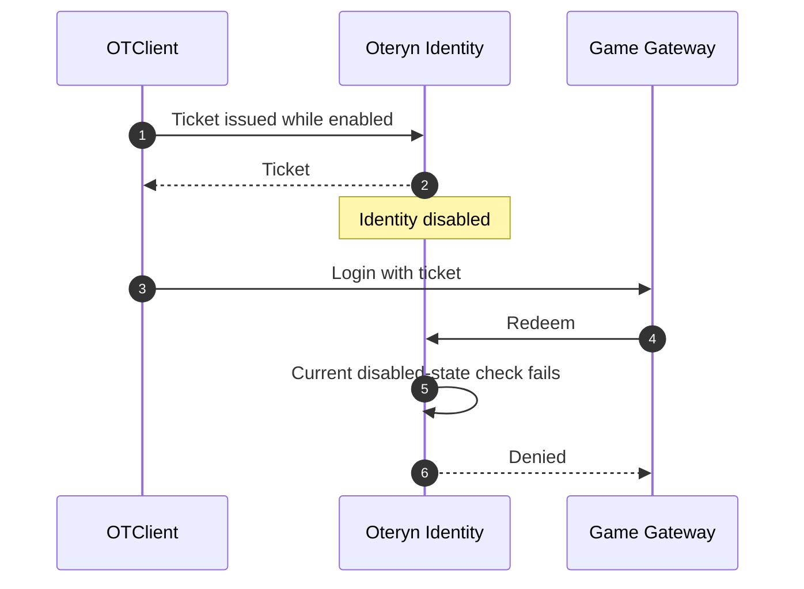
```mermaid
sequenceDiagram
    autonumber
    participant C as OTClient
    participant I as Oteryn Identity
    participant G as Game Gateway

    C->>I: Ticket issued while enabled
    I-->>C: Ticket
    Note over I: Identity disabled
    C->>G: Login with ticket
    G->>I: Redeem
    I->>I: Current disabled-state check fails
    I-->>G: Denied
```

## 15. Identity unavailable during redeem

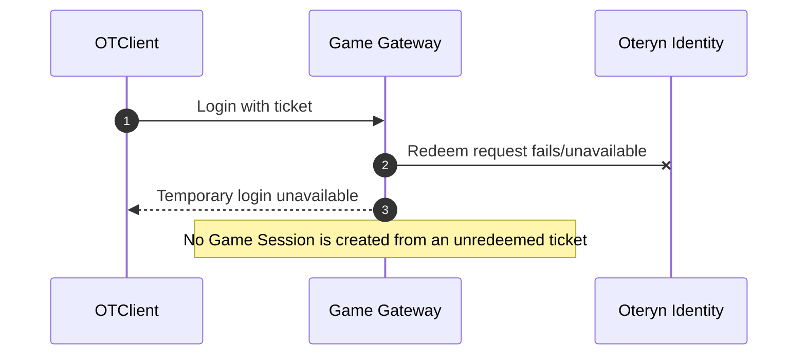
```mermaid
sequenceDiagram
    autonumber
    participant C as OTClient
    participant G as Game Gateway
    participant I as Oteryn Identity

    C->>G: Login with ticket
    G-xI: Redeem request fails/unavailable
    G-->>C: Temporary login unavailable
    Note over G: No Game Session is created from an unredeemed ticket
```

## 16. Ticket store unavailable

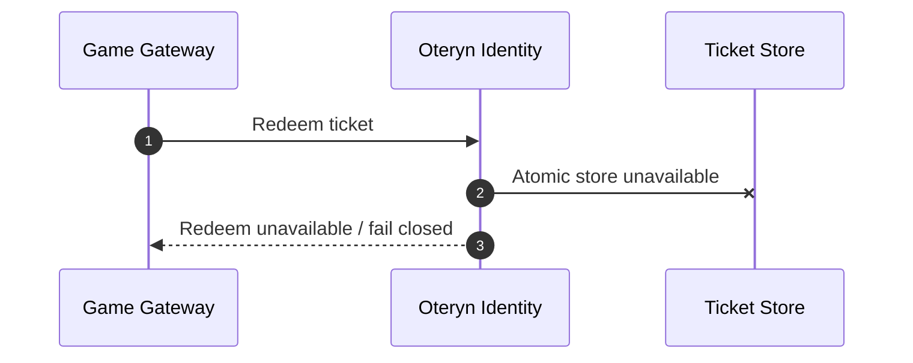
```mermaid
sequenceDiagram
    autonumber
    participant G as Game Gateway
    participant I as Oteryn Identity
    participant T as Ticket Store

    G->>I: Redeem ticket
    I-xT: Atomic store unavailable
    I-->>G: Redeem unavailable / fail closed
```

No cached success or password fallback is allowed.

## 17. World and character list resolution

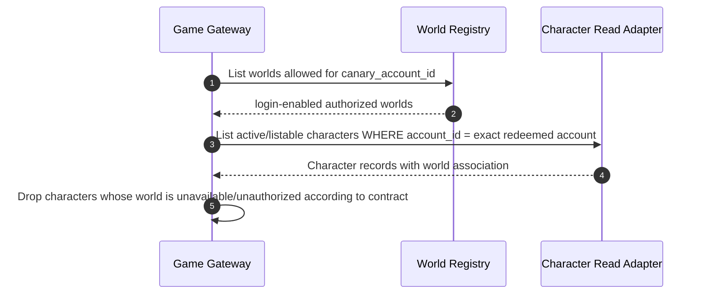
```mermaid
sequenceDiagram
    autonumber
    participant G as Game Gateway
    participant W as World Registry
    participant R as Character Read Adapter

    G->>W: List worlds allowed for canary_account_id
    W-->>G: login-enabled authorized worlds
    G->>R: List active/listable characters WHERE account_id = exact redeemed account
    R-->>G: Character records with world association
    G->>G: Drop characters whose world is unavailable/unauthorized according to contract
```

Client input never supplies authoritative ownership.

## 18. Game Session creation

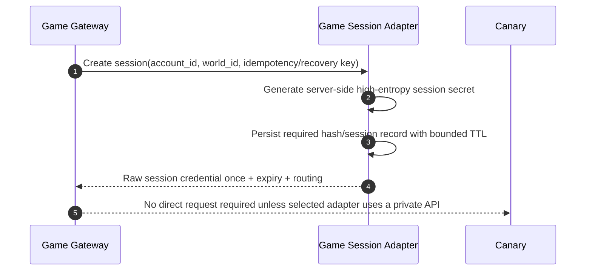
```mermaid
sequenceDiagram
    autonumber
    participant G as Game Gateway
    participant S as Game Session Adapter
    participant K as Canary

    G->>S: Create session(account_id, world_id, idempotency/recovery key)
    S->>S: Generate server-side high-entropy session secret
    S->>S: Persist required hash/session record with bounded TTL
    S-->>G: Raw session credential once + expiry + routing
    G-->>K: No direct request required unless selected adapter uses a private API
```

The exact persistence/API behavior is selected by `GAME_SESSION_CANARY_CONTRACT.md`; this diagram does not assume direct Canary HTTP support.

## 19. Session persistence failure

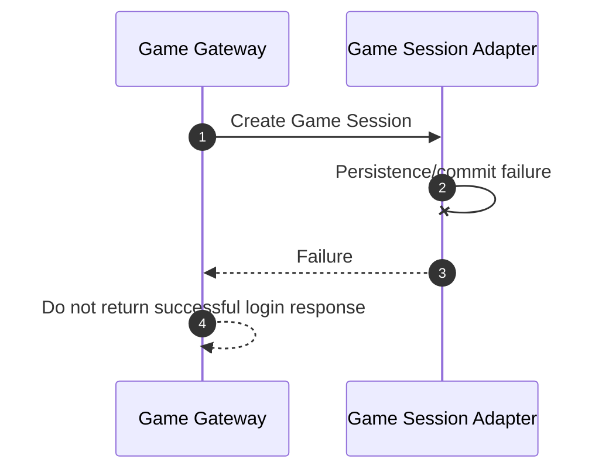
```mermaid
sequenceDiagram
    autonumber
    participant G as Game Gateway
    participant S as Game Session Adapter

    G->>S: Create Game Session
    S-xS: Persistence/commit failure
    S-->>G: Failure
    G-->>G: Do not return successful login response
```

The already-consumed Game Login Ticket is not resurrected. The client restarts the authorization/ticket flow unless a separately specified idempotent recovery record proves an already committed session.

## 20. Response lost after session commit

```mermaid
sequenceDiagram
    autonumber
    participant C as OTClient
    participant G as Game Gateway
    participant S as Game Session Adapter

    C->>G: Login request
    G->>S: Create session with bounded idempotency key
    S-->>G: Session committed
    G--xC: Network response lost
    C->>G: Retry original request/idempotency context if protocol permits
    G->>S: Recover existing committed result; do not create unbounded duplicate sessions
    S-->>G: Existing session result or safe retry classification
    G-->>C: Response
```

The exact retry mechanism remains an implementation decision of the Game Session adapter.

## 21. Character selected for wrong account

```mermaid
sequenceDiagram
    autonumber
    participant C as OTClient
    participant K as Canary

    C->>K: Game Session for account A + character owned by account B
    K->>K: Resolve authenticated session account A
    K->>K: Verify selected character ownership/deletion state
    K-->>C: Denied
```

Gateway should prevent this before routing, but Canary remains the final defense-in-depth ownership gate.

## 22. Canary unavailable

```mermaid
sequenceDiagram
    autonumber
    participant C as OTClient
    participant G as Game Gateway
    participant W as World Registry
    participant K as Canary

    C->>G: Login
    G->>W: Resolve world status/routing
    W-->>G: World available by registry state
    G-->>C: Session/routing
    C-xK: Connection fails
    C->>C: Show world connection failure
```

World Registry health and actual Canary reachability can race. The first release must not claim that a returned route guarantees successful world entry.

## 23. Legacy migration coexistence

```mermaid
sequenceDiagram
    autonumber
    participant O as Oteryn OTClient
    participant I as Oteryn Identity
    participant G as Game Gateway
    participant L as Legacy login-server/native login
    participant K as Canary

    alt New candidate path
        O->>I: Authorization Code + PKCE
        I-->>O: Ticket bootstrap
        O->>G: One-time Game Login Ticket
        G-->>O: Game Session + routing
        O->>K: Game Session login
    else Temporary legacy compatibility path
        O->>L: Legacy password login
        L-->>O: Legacy session/character list
        O->>K: Legacy game login
    end
```

During coexistence the stronger Identity policy is **not globally authoritative** while the legacy branch remains externally reachable and can authenticate independently.

## 24. Final authoritative topology after migration

```mermaid
flowchart LR
    C[OTClient] -->|System browser + PKCE| I[Oteryn Identity]
    I -->|One-time Game Login Ticket| C
    C -->|Ticket| G[Game Gateway]
    G -->|Private atomic redeem| I
    G -->|Game Session + routing| C
    C -->|Game Session| K[Canary]

    L[Legacy password login paths] -. disabled / fenced .- X((No public bypass))
```

## End-to-end success criterion

The target E2E is complete only when exact deployed components prove:

```text
Browser
-> Identity authentication/MFA
-> Authorization Code + PKCE
-> OTClient
-> Game Login Ticket
-> Gateway atomic redeem
-> exact bound Canary account
-> World Registry
-> Character List
-> Game Session
-> Canary final ownership/admission
-> Player enters game
```

without the main Oteryn password being sent to Game Gateway or Canary.
